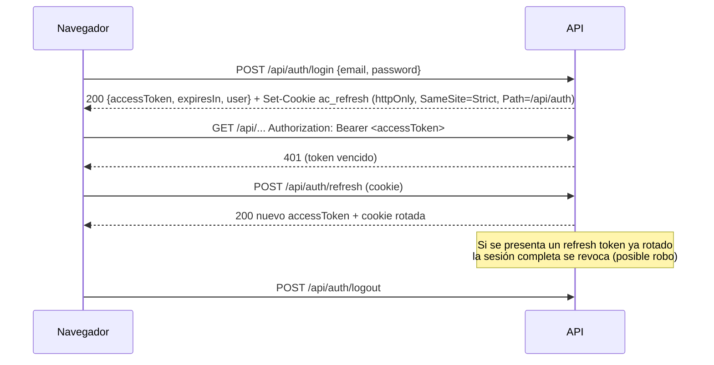

# API

- Base: `/api` (excepto `GET /health`)
- Documentación interactiva: **`/api/docs`** (Swagger UI, con "Authorize" para el Bearer token)
- Formato: JSON; fechas-instante ISO 8601 UTC; días calendario `YYYY-MM-DD`

## Autenticación



| Endpoint             | Descripción                                                                                                  |
| -------------------- | ------------------------------------------------------------------------------------------------------------ |
| `POST /auth/login`   | Máx. 5 intentos/min por IP. Mensaje idéntico para usuario inexistente, contraseña errónea o cuenta inactiva. |
| `POST /auth/refresh` | Rota la cookie.                                                                                              |
| `POST /auth/logout`  | Revoca la sesión actual.                                                                                     |
| `GET /auth/me`       | Perfil.                                                                                                      |

## Autorización

Cada endpoint declara permisos (`@RequirePermissions`). Matriz por rol en [`packages/shared/src/rbac.ts`](../packages/shared/src/rbac.ts). Además, los datos se filtran por fila: `SUPERVISOR` ve su equipo directo, `EMPLOYEE` solo sus propios datos.

## Errores

Todas las respuestas de error tienen la misma forma:

```json
{
  "statusCode": 400,
  "error": "BAD_REQUEST",
  "message": ["property isAdmin should not exist"],
  "path": "/api/employees",
  "timestamp": "2026-09-21T13:00:00.000Z",
  "requestId": "0b6e…"
}
```

| Código | Cuándo                                                                                          |
| ------ | ----------------------------------------------------------------------------------------------- |
| 400    | Validación (campos desconocidos también se rechazan)                                            |
| 401    | Sin token / token inválido o vencido                                                            |
| 403    | Sin permiso o fuera de su alcance                                                               |
| 404    | Recurso inexistente (o eliminado lógicamente)                                                   |
| 409    | Duplicado (código, IP:puerto, marcación manual), sincronización en curso, solicitud ya revisada |
| 429    | Rate limit                                                                                      |
| 500    | Error interno — sin detalles; buscar el `requestId` en los logs                                 |

## Endpoints

| Recurso               | Endpoints                                                                                                                                                                                                                                                                                                              |
| --------------------- | ---------------------------------------------------------------------------------------------------------------------------------------------------------------------------------------------------------------------------------------------------------------------------------------------------------------------- |
| Salud                 | `GET /health`                                                                                                                                                                                                                                                                                                          |
| Usuarios              | `GET/POST /users`, `GET/PATCH /users/:id`, `POST /users/:id/reset-password`                                                                                                                                                                                                                                            |
| Empleados             | `GET/POST /employees`, `GET/PATCH/DELETE /employees/:id` (paginación `page`, `pageSize`, `search`, `status`, `departmentId`)                                                                                                                                                                                           |
| Organización          | `GET/POST /departments`, `GET/PATCH/DELETE /departments/:id`; ídem `/positions`                                                                                                                                                                                                                                        |
| Horarios              | `GET/POST /work-shifts`, `PATCH /work-shifts/:id`, `GET/POST /work-schedules`, `GET/PATCH /work-schedules/:id`, `POST /work-schedules/assignments`, `DELETE /work-schedules/assignments/:id` (solo la última y si empezó hace ≤ 62 días), `GET /employees/:id/schedules`, `GET/POST /holidays`, `DELETE /holidays/:id` |
| Dispositivos          | `GET/POST /devices`, `GET /devices/drivers`, `GET/PATCH/DELETE /devices/:id`, `POST /devices/:id/test-connection`                                                                                                                                                                                                      |
| Sincronización        | `POST /devices/:id/sync`, `GET /devices/:id/sync-logs`, `GET /sync-logs`                                                                                                                                                                                                                                               |
| Simulador             | `GET /devices/:id/simulate`, `POST /devices/:id/simulate/{punch,workday,faults,auto}`                                                                                                                                                                                                                                  |
| Asistencia            | `GET /attendance/records`, `GET /attendance/events`, `POST /attendance/events` (manual), `POST /attendance/events/:id/void`, `POST /attendance/recompute`                                                                                                                                                              |
| Permisos / vacaciones | `GET/POST /leave-requests`, `POST /leave-requests/:id/review`, `POST /leave-requests/:id/cancel`. Una vacación que el saldo no cubre responde `409` al crearla o al aprobarla                                                                                                                                          |
| Saldos de vacaciones  | `GET /employees/:id/vacation-balance?asOf=`, `POST /employees/:id/vacation-adjustments`; `GET/POST /contract-types`, `GET/PATCH/DELETE /contract-types/:id`                                                                                                                                                            |
| Horas extra           | `GET /overtime`, `POST /overtime/:id/review`                                                                                                                                                                                                                                                                           |
| Reportes              | `GET /reports/{daily,monthly,late,absences,overtime,events,sync}?from&to&departmentId&format=csv`                                                                                                                                                                                                                      |
| Dashboard             | `GET /dashboard/summary`                                                                                                                                                                                                                                                                                               |
| Notificaciones        | `GET /notifications` (`unread`, paginación), `GET /notifications/unread-count`, `POST /notifications/:id/read`, `POST /notifications/read-all`. Siempre las del usuario autenticado; la de otro responde `404`                                                                                                         |
| Auditoría             | `GET /audit-logs`                                                                                                                                                                                                                                                                                                      |
| Configuración         | `GET /settings`, `PATCH /settings/attendance-policy`                                                                                                                                                                                                                                                                   |

### Ejemplos

```bash
TOKEN=$(curl -s -X POST localhost:3000/api/auth/login -H 'content-type: application/json' \
  -d '{"email":"admin@asistcontrol.local","password":"AsistControl2026"}' | jq -r .accessToken)

# Registrar un marcador
curl -X POST localhost:3000/api/devices -H "authorization: Bearer $TOKEN" -H 'content-type: application/json' -d '{
  "name":"Entrada principal","driver":"MOCK","manufacturer":"ZKTeco","model":"K40",
  "host":"192.168.1.201","port":4370,"location":"Recepción","credentials":{"commKey":"0"}
}'

# Sincronizar
curl -X POST localhost:3000/api/devices/<id>/sync -H "authorization: Bearer $TOKEN"
# → { "status":"SUCCESS", "recordsReceived":40, "recordsProcessed":40, "recordsDuplicated":0, ... }

# Reporte mensual para nómina
curl -OJ "localhost:3000/api/reports/monthly?from=2026-09-01&format=csv" -H "authorization: Bearer $TOKEN"
```

## Tiempo real (Socket.IO)

```ts
import { io } from 'socket.io-client';
const socket = io('/realtime', { auth: { token: accessToken }, transports: ['websocket'] });
socket.on('attendance.event.created', (e) => …);
```

| Evento                      | Payload                                                                                                  |
| --------------------------- | -------------------------------------------------------------------------------------------------------- |
| `attendance.event.created`  | `{ id, occurredAt, punchType, deviceId, deviceName, deviceUserId, employee }`                            |
| `attendance.record.updated` | `{ employeeId, workDate, status, lateMinutes, workedMinutes }`                                           |
| `device.status.changed`     | `{ deviceId, name, status, lastError, lastSyncAt }`                                                      |
| `device.sync.finished`      | `{ deviceId, syncLogId, status, recordsReceived, recordsProcessed, recordsDuplicated, recordsRejected }` |
| `notification.created`      | `{ id, type, data, entity, entityId, readAt, createdAt }` — solo al destinatario                         |

Tipos en [`packages/shared/src/realtime.ts`](../packages/shared/src/realtime.ts). Cada cliente recibe solo los eventos que su rol y alcance permiten.

### Notificaciones

Una notificación trae **datos, no texto**: `type` más `data` con forma fija por tipo ([`packages/shared/src/notifications.ts`](../packages/shared/src/notifications.ts)); cada cliente la redacta. Quién recibe cada tipo y por qué hay un solo aviso por corte de un equipo: [ADR 0007](adr/0007-notifications.md).

| `type`             | `data`                                                          | Destinatarios                                 |
| ------------------ | --------------------------------------------------------------- | --------------------------------------------- |
| `DEVICE_DOWN`      | `{ deviceName, status: "OFFLINE" \| "ERROR", error }`           | Con `devices:sync` (administradores)          |
| `DEVICE_RECOVERED` | `{ deviceName }`                                                | Con `devices:sync`                            |
| `LEAVE_REQUESTED`  | `{ employeeName, leaveType, startsAt, endsAt }`                 | RRHH, administradores y el supervisor directo |
| `LEAVE_REVIEWED`   | `{ employeeName, leaveType, startsAt, endsAt, decision, note }` | El empleado y quien presentó la solicitud     |
