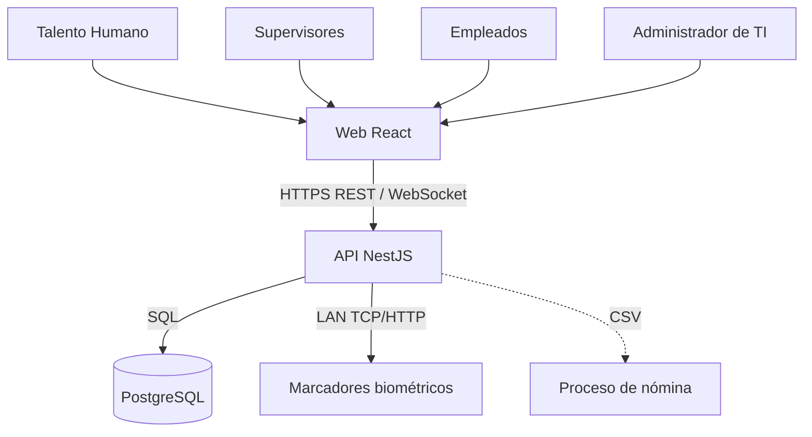
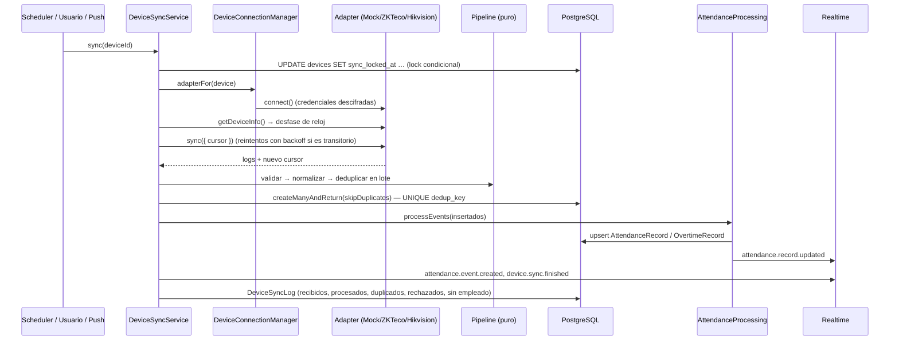

# Arquitectura

## Objetivos que guían el diseño

1. **Independencia del fabricante.** Ninguna regla de negocio conoce ZKTeco, Hikvision u otra marca.
2. **Nunca perder ni duplicar una marcación.** La ingesta es idempotente y todo fallo es recuperable.
3. **El pasado es reproducible.** Las jornadas se pueden recalcular desde las marcaciones en cualquier momento con el mismo resultado.
4. **Reglas laborales configurables**, sin valores fijos de un país en el código.
5. **Seguro por defecto**: todo endpoint requiere autenticación salvo que se marque explícitamente como público.

## Vista de contexto



## Estructura del backend (por dominio)

```
apps/api/src/
  auth/            login, refresh rotativo, logout, perfil
  users/           cuentas y roles (con reglas de privilegio)
  employees/       empleados, soft delete, vinculación de marcaciones huérfanas
  departments/     positions/
  work-schedules/  turnos, horarios semanales, asignaciones con historial, feriados
  attendance/
    domain/        ← reglas de negocio PURAS (sin Nest, sin Prisma, sin reloj)
    work-calendar.service.ts         calendario en memoria para recálculos masivos
    attendance-processing.service.ts eventos → jornadas (idempotente)
    attendance.service.ts            consultas, correcciones manuales, anulaciones
    attendance.scheduler.ts          cierre horario de jornadas
  devices/         CRUD, gestor de conexiones, registro de drivers, simulador
  device-sync/     pipeline de ingesta, orquestador, polling programado
  leave-requests/  permisos y vacaciones
  overtime/        aprobación de horas extra
  reports/         read models + CSV
  dashboard/       KPIs del día
  audit/           bitácora inmutable
  realtime/        gateway Socket.IO + fachada de publicación
  settings/        política laboral y zona horaria
  health/          liveness + base de datos
  common/          guards, decorators, filtros, alcance por fila, cifrado, utilidades
```

Regla de dependencias: los **controllers** solo traducen HTTP ↔ servicio; los **servicios de aplicación** orquestan (cargan datos, llaman al dominio, persisten, publican); el **dominio** (`attendance/domain`) no importa nada de infraestructura. Esto es lo que permite probar el cálculo de jornadas con más de 40 casos sin base de datos.

## Flujo de sincronización



Decisiones clave:

| Problema                                                                           | Solución                                                                                                                                                                                        |
| ---------------------------------------------------------------------------------- | ----------------------------------------------------------------------------------------------------------------------------------------------------------------------------------------------- |
| Re-descargar los mismos registros (reintentos, memoria del equipo que no se borra) | `dedup_key = sha256(origen \| dispositivo \| usuario \| segundo)` con índice **UNIQUE**; insertar con `skipDuplicates`. Re-sincronizar es siempre seguro.                                       |
| Relojes de equipo que se atrasan o memoria borrada                                 | El **cursor es opaco y lo define cada adaptador** (índice + generación de memoria en el simulador). No se usa "última fecha vista" como cursor. Ver [ADR 0004](adr/0004-opaque-sync-cursor.md). |
| Dos instancias de la API sincronizando el mismo equipo                             | Lock por fila: `UPDATE … WHERE sync_locked_at IS NULL OR sync_locked_at < now() - 10 min`. El segundo intento recibe `409`.                                                                     |
| Equipo sin red durante horas                                                       | El push en tiempo real es una optimización; el **polling** periódico recupera todo lo que quedó en la memoria del equipo.                                                                       |
| Marcaciones de un ID biométrico aún no registrado                                  | Se guardan con `employee_id = NULL` (nunca se pierden) y se vinculan automáticamente cuando RRHH registra al empleado con ese ID.                                                               |
| Datos corruptos (fecha 2000-01-01, IDs inválidos)                                  | Rechazados por el pipeline, contados en el log con su motivo; el resto del lote continúa (`PARTIAL`).                                                                                           |

## Motor de asistencia

`calculateAttendance(input)` recibe la jornada resuelta (turno anclado a fechas absolutas en la zona horaria de la empresa), las marcaciones, los permisos aprobados, la política y `now`; devuelve la jornada calculada. Pasos:

1. Filtrar marcaciones a la **ventana** de la jornada (por defecto de 4 h antes del inicio a 6 h después del fin). Así una marcación a las 02:00 pertenece al turno nocturno del día anterior.
2. **Doble marcación**: marcaciones a menos de `duplicatePunchWindowSeconds` (60 s) de la anterior se ignoran.
3. **Emparejado** entrada/salida: `SEQUENTIAL` (alterna, robusto frente a quien presiona la tecla equivocada) o `DEVICE_TYPE` (confía en el tipo que reporta el equipo).
4. Tiempo trabajado, pausas, descuento del almuerzo no marcado (configurable).
5. Atraso y salida anticipada contra la **presencia esperada**, que se desplaza si hay un permiso aprobado al inicio o al final del turno.
6. Horas extra según `AFTER_SHIFT_END` o `EXCESS_WORKED_TIME`, con umbral mínimo. En día libre o feriado todo lo trabajado es extra de ese tipo.
7. Estado final y **novedades** (`LATE_ARRIVAL`, `MISSING_CHECK_OUT`, `OUT_OF_SCHEDULE_PUNCH`, …).

`isFinal = false` mientras la ventana de la jornada está abierta: una salida al almuerzo no se reporta como "salida anticipada" y un empleado que aún trabaja no aparece como "sin salida". El job horario `attendance-finalizer` cierra las jornadas y genera las ausencias.

### Reglas de negocio configurables

Todas viven en `SystemSetting["attendance.policy"]` (editable vía `PATCH /api/settings/attendance-policy`, auditado) y los turnos pueden sobrescribir tolerancias:

| Parámetro                             | Por defecto       | Significado                                             |
| ------------------------------------- | ----------------- | ------------------------------------------------------- |
| `lateToleranceMinutes`                | 5                 | Minutos de gracia; superados, el atraso cuenta completo |
| `earlyLeaveToleranceMinutes`          | 0                 | Gracia para salida anticipada                           |
| `overtimeThresholdMinutes`            | 15                | Mínimo para reconocer horas extra                       |
| `overtimeBasis`                       | `AFTER_SHIFT_END` | O `EXCESS_WORKED_TIME` (compensa atrasos primero)       |
| `countEarlyArrivalAsOvertime`         | `false`           | Llegar antes cuenta como extra                          |
| `punchPairing`                        | `SEQUENTIAL`      | O `DEVICE_TYPE`                                         |
| `autoDeductUnpunchedBreak`            | `true`            | Descontar almuerzo si no se marcó                       |
| `minBreakMinutes`                     | 0                 | Almuerzo mínimo (0 = no se controla)                    |
| `duplicatePunchWindowSeconds`         | 60                | Ventana de doble marcación                              |
| `outOfScheduleMarginMinutes`          | 180               | Margen para marcar "fuera de horario"                   |
| `punchWindowBefore/AfterShiftMinutes` | 240 / 360         | Ventana de pertenencia de marcaciones                   |

> **Sobre legislación laboral.** Ningún valor asume la ley de Ecuador ni de otro país. Recargos de horas suplementarias/extraordinarias, límites semanales o jornada nocturna legal deben configurarse o implementarse como políticas explícitas y documentadas (ver roadmap). Los feriados del seed son **datos de ejemplo**.

> **Nota sobre el ejemplo del enunciado.** Con marcaciones 08:01 / 12:00 / 13:00 / 17:05 el tiempo trabajado es **8 h 04 m** (3 h 59 m + 4 h 05 m), no 7 h 04 m; el resto (1 min de atraso, 5 min de extra) coincide con tolerancia y umbral en 0. El caso está cubierto por un test.

## Tiempo real

Socket.IO en el namespace `/realtime`, autenticado con el mismo access token. Cada socket se une a salas según lo que puede ver: `attendance:all` (RRHH/Admin), `attendance:supervisor:<id>` y `attendance:employee:<id>`, `devices`, y `user:<id>` para lo dirigido a una sola persona (notificaciones). Así un supervisor solo recibe eventos de su equipo. El frontend agrega los eventos nuevos directamente a la caché de TanStack Query (sin refetch) y refresca los agregados en segundo plano.

## Notificaciones

Los hechos que alguien debe atender (un marcador caído o recuperado, una solicitud por revisar o ya resuelta) se guardan como una notificación **por destinatario**, con tipo y datos, y se envían en vivo a la sala `user:<id>`. Los destinatarios salen de la matriz RBAC y del alcance por fila; un corte de un equipo produce **un** aviso aunque falle en cada sondeo. Notificar es de mejor esfuerzo: nunca bloquea la acción que lo provocó. Ver [ADR 0007](adr/0007-notifications.md).

## Frontend

- **Estado del servidor** con TanStack Query; **Zustand solo para la sesión**, porque el cliente HTTP necesita el token fuera de React.
- Access token solo en memoria; al recargar se restaura con la cookie httpOnly. Los `401` concurrentes comparten **un único refresh** (el servidor rota el token y trataría un segundo uso como robo).
- Tokens de diseño en CSS (`--surface-*`, `--ink-*`, estados), modo claro y oscuro propios.
- Gráficos: una sola serie (marcaciones por hora) con un solo color; los estados (presente/atraso/ausencia) usan la paleta de estados reservada y siempre van con icono + etiqueta; cada gráfico ofrece vista de tabla.
- Los recorridos completos (sesión y cookie de refresco, rutas por rol, ciclo de un marcador, tiempo real, descarga de CSV, uso en teléfono) se verifican en un navegador real con Playwright sobre el bundle de producción: [`apps/e2e/`](../apps/e2e/README.md).

## Observabilidad

- Logs estructurados JSON (pino) con `requestId` de correlación (propaga `X-Request-Id` del proxy); cabeceras de autorización y cookies redactadas.
- Todas las respuestas de error incluyen el `requestId` para rastrear un reporte de usuario hasta el log.
- `GET /health` para Docker y balanceadores; `DeviceSyncLog` como métrica de negocio de cada dispositivo.

## Decisiones registradas (ADR)

| #                                           | Decisión                                                       |
| ------------------------------------------- | -------------------------------------------------------------- |
| [0001](adr/0001-monorepo-and-stack.md)      | Monorepo con npm workspaces y versiones estables               |
| [0002](adr/0002-adapter-pattern-devices.md) | Patrón Adapter + registro de drivers para dispositivos         |
| [0003](adr/0003-rbac-in-code.md)            | Roles fijos y permisos en código + alcance por fila            |
| [0004](adr/0004-opaque-sync-cursor.md)      | Cursor de sincronización opaco por adaptador                   |
| [0005](adr/0005-events-vs-records.md)       | Marcaciones inmutables, jornadas derivadas y recalculables     |
| [0006](adr/0006-unified-leave-requests.md)  | Permisos y vacaciones en un único flujo                        |
| [0007](adr/0007-notifications.md)           | Notificaciones: datos por destinatario, un aviso por incidente |
