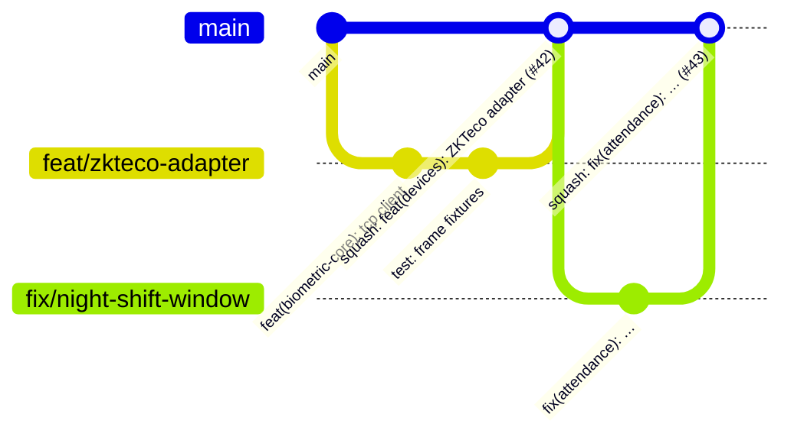

# Guía de contribución

## Flujo de trabajo (trunk-based)



1. `main` siempre es desplegable y está **protegida**: sin push directo, todo entra por PR con la CI en verde (y la aprobación de CODEOWNERS en cuanto haya más de un mantenedor).
2. Crea una rama corta desde `main`: `feat/…`, `fix/…`, `docs/…`, `refactor/…`, `test/…`, `ci/…`, `chore/…`.
3. Abre el PR temprano (draft) y enlaza el issue (`Closes #123`).
4. Se integra con **squash merge**; el título del PR (validado por CI) es el commit en `main`.

## Mensajes de commit — Conventional Commits

```
<tipo>(<ámbito opcional>): <descripción en imperativo>

feat(attendance): support night shifts crossing midnight
fix(sync): do not advance the cursor when ingestion fails
docs(api): document realtime events
```

Tipos: `feat`, `fix`, `docs`, `refactor`, `perf`, `test`, `build`, `ci`, `chore`. Un cambio incompatible añade `!` (`feat(api)!: …`) y una sección `BREAKING CHANGE:`.

## Antes de abrir el PR

```bash
npm run lint && npm run format:check && npm run typecheck && npm test
npm run test:e2e   # si tocaste API, base de datos o sincronización
```

La CI ejecuta lo mismo (más e2e con PostgreSQL, verificación de migraciones, build de imágenes y CodeQL) y **bloquea el merge** si algo falla. No se usan `--no-verify`, `eslint-disable` injustificados ni tests `skip`.

> No se instaló Husky: los hooks locales duplicarían la CI y se saltan con facilidad. La CI es la barrera real; si el equipo lo prefiere, se puede añadir `lint-staged` para formateo previo al commit.

## Criterios de código

- La lógica de negocio va en servicios o en `domain/` (puro), **nunca en controllers**.
- Toda regla laboral nueva es configurable y tiene tests de sus casos límite.
- Nada de valores mágicos: constantes con nombre y explicación.
- Toda operación que cambia datos sensibles se audita, preferiblemente en la misma transacción.
- DTOs con `class-validator` y decoradores Swagger para cada endpoint nuevo.
- Nuevos enums: en Prisma y en `packages/shared` (el test de contrato lo exige).
- Cambios de esquema: migración + actualización de `docs/database.md`.
- Decisiones de arquitectura relevantes: un ADR en `docs/adr/`.

## Revisión

El revisor verifica: corrección (casos límite, zonas horarias, concurrencia), seguridad (permisos y alcance), pruebas que fallarían sin el cambio, y que la documentación acompañe al código.

## Configuración recomendada del repositorio en GitHub

- Branch protection en `main`: _Require a pull request_, _Require status checks_ (`Lint · Typecheck · Unit tests · Build`, `conventional-title`, y `API e2e (PostgreSQL)` / `Docker images` cuando existan), _Require branches to be up to date_, _Require linear history_, sin force-push ni borrado.
- Mientras haya un solo mantenedor no se exigen aprobaciones (GitHub no permite aprobar el PR propio); al sumar colaboradores se activa _Require approvals (1)_ + _Require review from Code Owners_.
- _Allow squash merging_ únicamente; _Automatically delete head branches_.
- Secret scanning y push protection activados.
