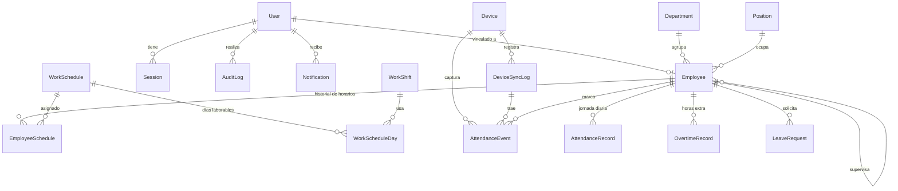

# Base de datos

PostgreSQL 17 gestionado con Prisma 6 ([`schema.prisma`](../apps/api/prisma/schema.prisma), migraciones versionadas en `apps/api/prisma/migrations`).

Convenciones:

- Tablas y columnas en `snake_case` (`@@map` / `@map`), modelos en `PascalCase`.
- IDs `uuid`.
- Instantes como `timestamptz` (UTC). Días calendario como `date`, interpretados en la zona horaria de la empresa.
- **Soft delete** (`deleted_at`) donde borrar rompería historia: empleados, dispositivos, departamentos, cargos, turnos, horarios.
- Enums de Postgres sincronizados con `packages/shared` (verificado por test).

## Modelo



## Entidades y por qué existen

| Entidad                            | Razón de negocio                                                                                                                                                                                         |
| ---------------------------------- | -------------------------------------------------------------------------------------------------------------------------------------------------------------------------------------------------------- |
| `User`                             | Cuenta de acceso con un rol; opcionalmente vinculada a un empleado (para alcance "mis datos").                                                                                                           |
| `Session`                          | Una por login. Guarda el **hash** del refresh token actual para rotarlo y revocarlo (logout, desactivación, robo).                                                                                       |
| `Department`, `Position`           | Organización; filtros de reportes.                                                                                                                                                                       |
| `Employee`                         | Persona. `biometric_id` único enlaza las marcaciones de los equipos. `supervisor_id` define el equipo de un supervisor.                                                                                  |
| `WorkShift`                        | Plantilla de turno (horas locales `HH:mm`, almuerzo, tolerancias propias). `end <= start` ⇒ cruza medianoche.                                                                                            |
| `WorkSchedule` + `WorkScheduleDay` | Patrón semanal; los días sin fila son días libres.                                                                                                                                                       |
| `EmployeeSchedule`                 | **Historial** de asignaciones con vigencia. Un cambio de horario no altera cómo se evaluaron los días anteriores.                                                                                        |
| `Holiday`                          | Feriados (fecha única).                                                                                                                                                                                  |
| `Device`                           | Marcador en la LAN: driver, host/puerto, estado, `config` (no secreta), `credentials_encrypted`, cursor de sincronización y lock.                                                                        |
| `DeviceSyncLog`                    | Auditoría operativa de cada descarga: recibidos, procesados, duplicados, rechazados, sin empleado, error.                                                                                                |
| `AttendanceEvent`                  | Marcación **cruda e inmutable** (dispositivo o manual). `dedup_key` UNIQUE garantiza idempotencia. Las correcciones son eventos nuevos o anulaciones (`voided_at`), nunca ediciones.                     |
| `AttendanceRecord`                 | Jornada **derivada** (única por empleado y fecha): horario vigente, entrada/salida, minutos trabajados, atraso, extra, novedades, `is_final`. Se puede reconstruir en cualquier momento.                 |
| `OvertimeRecord`                   | Propuesta de horas extra con aprobación; una decisión humana nunca se sobrescribe por un recálculo.                                                                                                      |
| `LeaveRequest`                     | Permisos (por horas o días) y vacaciones con flujo de aprobación.                                                                                                                                        |
| `AuditLog`                         | Bitácora _append-only_: actor, acción, entidad, IP, user-agent, metadata (secretos redactados).                                                                                                          |
| `Notification`                     | Aviso para **un** usuario (dispositivo caído o recuperado, solicitud por revisar o resuelta). Guarda `type` + `data` JSON, no texto; `read_at` por destinatario ([ADR 0007](adr/0007-notifications.md)). |
| `SystemSetting`                    | Política laboral y zona horaria editables en caliente.                                                                                                                                                   |

### Diferencias respecto a la lista inicial de entidades (y por qué)

| Propuesto                               | Decisión                                                                                                                                                                                      |
| --------------------------------------- | --------------------------------------------------------------------------------------------------------------------------------------------------------------------------------------------- |
| `Role`, `Permission` como tablas        | Roles fijos + permisos en código compartido con el frontend ([ADR 0003](adr/0003-rbac-in-code.md)). Evita tablas y joins sin caso de uso actual; se migrará si aparecen roles personalizados. |
| `DeviceType`                            | Reemplazado por el enum `driver` + `manufacturer`/`model` texto: el comportamiento lo define el adaptador, no una tabla.                                                                      |
| `PermissionRequest` + `VacationRequest` | Unificadas en `LeaveRequest.type` ([ADR 0006](adr/0006-unified-leave-requests.md)). Mismo flujo, mismo efecto en asistencia; evita el choque de nombres con permisos RBAC.                    |
| `Notification`                          | Añadida con destinatario, tipo y datos, sin texto: el cliente redacta y la API no depende del idioma ([ADR 0007](adr/0007-notifications.md)).                                                 |
| —                                       | Añadidas: `Session`, `EmployeeSchedule`, `WorkScheduleDay`, `Holiday`, porque son necesarias para seguridad, historia de horarios y feriados.                                                 |

## Índices relevantes

| Índice                                               | Consulta que sirve                   |
| ---------------------------------------------------- | ------------------------------------ |
| `attendance_events (employee_id, occurred_at)`       | Recalcular la ventana de una jornada |
| `attendance_events (dedup_key)` UNIQUE               | Idempotencia de la ingesta           |
| `attendance_records (employee_id, work_date)` UNIQUE | Upsert de la jornada                 |
| `attendance_records (work_date, status)`             | Reportes y dashboard                 |
| `attendance_records (is_final, work_date)`           | Finalizador horario                  |
| `device_sync_logs (device_id, started_at DESC)`      | Historial por equipo                 |
| `audit_logs (entity, entity_id)`, `(created_at)`     | Búsqueda en auditoría                |
| `notifications (user_id, read_at, created_at DESC)`  | La campana: mis no leídas, recientes |
| `notifications (type, entity_id, created_at)`        | "¿Ya se avisó de este incidente?"    |

## Migraciones

```bash
npm run db:migrate                          # desarrollo: crea y aplica
npx prisma migrate deploy                   # CI/producción: solo aplica (lo hace el contenedor al iniciar)
```

- Toda modificación del esquema va con su migración en el mismo PR. La CI verifica que las migraciones reproduzcan exactamente el `schema.prisma` (`migrate diff --exit-code`).
- Las migraciones con transformación de datos se editan a mano y se documentan en el SQL (ejemplo: `device_sync_cursor_opaque`).
- Nunca se modifica una migración ya publicada; se crea una nueva.

## Retención y datos personales

Las marcaciones y jornadas son registros laborales: no se eliminan físicamente. Las **notificaciones** sí: una tarea diaria borra las de más de 90 días, porque son avisos y lo ocurrido ya consta en la auditoría. Los datos biométricos **no** se almacenan (solo el ID de enrolamiento; las huellas/rostros permanecen en el equipo).
