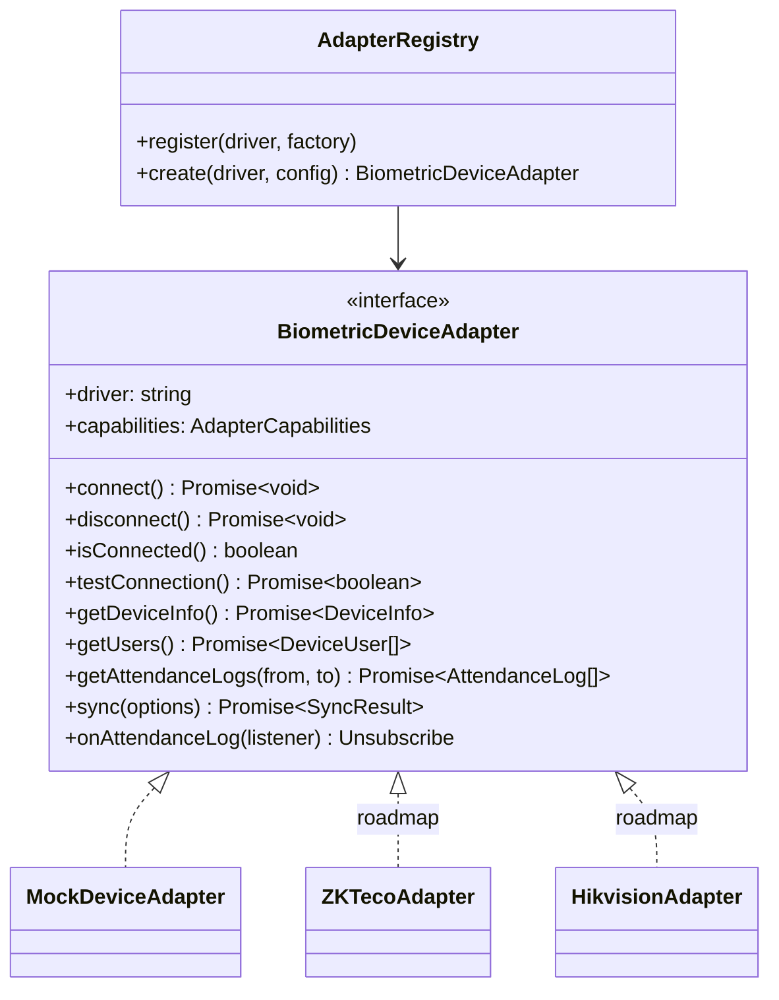

# Integración de dispositivos biométricos

## Principio

La plataforma habla con **una interfaz**, nunca con un fabricante. Un adaptador es un _traductor de transporte_: convierte el protocolo del equipo en `AttendanceLog` normalizados y errores tipados. **No persiste datos ni aplica reglas de negocio** — eso lo hacen el pipeline y el motor de asistencia, iguales para todas las marcas.



Código: [`packages/biometric-core`](../packages/biometric-core/src).

## Contrato

| Método              | Obligaciones                                                                                                                                                                 |
| ------------------- | ---------------------------------------------------------------------------------------------------------------------------------------------------------------------------- |
| `connect()`         | Abrir sesión/socket y autenticar. Lanzar `DeviceConnectionError` (red) o `DeviceAuthenticationError` (credenciales).                                                         |
| `testConnection()`  | **Nunca lanza**: `true`/`false`.                                                                                                                                             |
| `getDeviceInfo()`   | Serie, modelo, firmware, contadores y **hora del equipo** (se usa para detectar desfase de reloj).                                                                           |
| `sync({ cursor })`  | Devolver los registros nuevos desde `cursor` y un nuevo cursor opaco. Si no sabe continuar (memoria borrada, cursor inválido) debe **releer todo**: la plataforma deduplica. |
| `onAttendanceLog()` | Solo si `capabilities.realtime`. Debe entregar marcaciones únicamente mientras hay conexión real.                                                                            |

Todas las operaciones deben respetar `config.timeoutMs` (usar `withTimeout`). Errores:

| Error                                                                    | `retryable` | Efecto en la plataforma                                  |
| ------------------------------------------------------------------------ | ----------- | -------------------------------------------------------- |
| `DeviceConnectionError`, `DeviceTimeoutError`, `DeviceNotConnectedError` | sí          | 3 reintentos con backoff; si persiste → estado `OFFLINE` |
| `DeviceProtocolError`, `DeviceAuthenticationError`                       | no          | Sin reintento → estado `ERROR` con el mensaje            |

## Añadir un fabricante (paso a paso)

1. **Implementar** `packages/biometric-core/src/<vendor>/<vendor>.adapter.ts` con la interfaz. Mapear sus tipos de marcación a `PunchType` y su modo de verificación a `VerifyMode` (lo desconocido → `UNKNOWN` / `OTHER`; nunca descartar).
2. **Elegir la semántica del cursor** que el protocolo permita (índice de registro, número de secuencia, id incremental). Evitar timestamps salvo que el equipo no ofrezca otra cosa; en ese caso, releer una ventana de solapamiento.
3. **Probar** con un servidor falso del protocolo o grabaciones de tramas (no depender de hardware en CI).
4. **Registrar** el driver en [`apps/api/src/devices/adapters.provider.ts`](../apps/api/src/devices/adapters.provider.ts):
   ```ts
   registry.register('ZKTECO', (connection) => new ZKTecoAdapter(connection));
   ```
5. Si es un driver nuevo, añadir el valor al enum `DeviceDriver` (Prisma **y** `packages/shared` — un test verifica que coincidan) con su migración.
6. Documentar aquí particularidades (puertos, clave de comunicación, límites de memoria).

## Identificación de empleados

`AttendanceLog.deviceUserId` se asocia a `Employee.biometricId`. El sistema asume un **ID de enrolamiento común a todos los equipos** (práctica habitual al replicar usuarios entre marcadores). Si una instalación usa IDs distintos por equipo, se requerirá una tabla de mapeo por dispositivo (roadmap).

## Credenciales

Las credenciales (clave de comunicación, usuario/contraseña ISAPI) se envían al registrar el dispositivo, se guardan cifradas con AES-256-GCM (`DEVICE_SECRETS_KEY`) y **nunca se devuelven** por la API (`hasCredentials: true`). Solo `DeviceConnectionManager` las descifra, en memoria, al construir el adaptador.

## Simulador (driver `MOCK`)

`MockDeviceSimulator` es un terminal virtual en memoria; `MockDeviceNetwork` simula la LAN (host:puerto → equipo). Se controla desde la UI (_Dispositivos → Simulador_) o la API:

| Endpoint                                 | Efecto                                                                                                                                                                                                                                                                 |
| ---------------------------------------- | ---------------------------------------------------------------------------------------------------------------------------------------------------------------------------------------------------------------------------------------------------------------------- |
| `POST /api/devices/:id/simulate/workday` | Genera la jornada de los empleados según **su turno real** y un escenario: `ON_TIME`, `LATE`, `EARLY_LEAVE`, `OVERTIME`, `MISSING_EXIT`, `NO_LUNCH`, `DUPLICATE_PUNCH`, `ABSENT` o `MIXED` (distribución realista). Quedan en la memoria del equipo hasta sincronizar. |
| `POST /api/devices/:id/simulate/punch`   | Una marcación ahora (por `employeeId` o `deviceUserId` arbitrario). Llega por _push_ si hay conexión.                                                                                                                                                                  |
| `POST /api/devices/:id/simulate/auto`    | Marcaciones aleatorias en vivo cada N ms.                                                                                                                                                                                                                              |
| `POST /api/devices/:id/simulate/faults`  | `online:false` (desconexión), `failNext: TIMEOUT \| PROTOCOL \| CONNECTION`, `dropConnectionAfter: n`, `duplicateOnRead`, `latencyMs`, `clockSkewSeconds`, `reset`.                                                                                                    |
| `GET /api/devices/:id/simulate`          | Estado del terminal virtual.                                                                                                                                                                                                                                           |

Recorrido típico (dispositivo `$ID`, token `$TOKEN`):

```bash
H="authorization: Bearer $TOKEN"; J='content-type: application/json'
# 1. El equipo guarda en su memoria la jornada de todos los empleados con turno ese día
curl -X POST localhost:3000/api/devices/$ID/simulate/workday -H "$H" -H "$J" -d '{"date":"2026-09-21","scenario":"MIXED"}'
# 2. Se corta la red: la sincronización falla y el dispositivo pasa a OFFLINE
curl -X POST localhost:3000/api/devices/$ID/simulate/faults -H "$H" -H "$J" -d '{"online":false}'
curl -X POST localhost:3000/api/devices/$ID/sync -H "$H"
# 3. Vuelve la red: se descarga todo lo pendiente, sin duplicados
curl -X POST localhost:3000/api/devices/$ID/simulate/faults -H "$H" -H "$J" -d '{"reset":true}'
curl -X POST localhost:3000/api/devices/$ID/sync -H "$H"
```

El simulador y sus endpoints solo existen con `ENABLE_MOCK_DEVICES=true`; en producción deben deshabilitarse.
